### Computer Vision · Speech AI · Edge AI · Multi-Agent Systems

**Engineering AI systems from model development to real-world deployment.**

  
  
  
  

---

## About

I’m an **Applied AI/ML Engineer** and Computer Science Engineering graduate focused on taking models from experimentation to practical deployment.

My work spans **computer vision, multilingual speech systems, edge inference, model optimization, AI-backed applications, and multi-agent research workflows**.

I care about measurable model quality, inference performance, reproducible engineering, and systems that remain useful beyond a demo.

---

## Engineering Impact

<table>
<tr>

<td align="center" width="33%">
<h3>98.3%</h3>
YOLOv8 <b>mAP50</b> 
Wildlife Detection
</td>

<td align="center" width="33%">
<h3>94.5%</h3>
Model <b>Precision</b> 
Leopard Detection
</td>

<td align="center" width="33%">
<h3>&lt;200 ms</h3>
CPU <b>Inference</b> 
Multilingual TTS
</td>

</tr>

<tr>

<td align="center" width="33%">
<h3>92%</h3>
Daytime <b>Extraction</b> 
ANPR Pipeline
</td>

<td align="center" width="33%">
<h3>6,000+</h3>
Images <b>Curated</b> 
Training Pipeline
</td>

<td align="center" width="33%">
<h3>3 Languages</h3>
Marathi · Hindi · English 
Speech AI
</td>

</tr>
</table>

---

## Applied AI Systems

<table>
<tr>
<td width="33%" valign="top">

### Vyaghra-Drishti

**Edge-AI Wildlife Surveillance**

Built a wildlife detection system designed for low-power edge environments.

- YOLOv8 leopard detection
- 6,000+ curated images
- **98.3% mAP50**
- **94.5% precision**
- Edge-focused deployment

`Python` `YOLOv8` `OpenCV` `Edge AI`

</td>

<td width="33%" valign="top">

### Ira

**Multilingual Speech AI**

Built a multilingual Text-to-Speech system supporting regional Indian languages.

- Marathi
- Hindi
- English
- Piper VITS
- PyTorch → ONNX optimization
- **Sub-200 ms CPU inference**

`Python` `PyTorch` `VITS` `ONNX`

</td>

<td width="33%" valign="top">

### ANPR Pipeline

**Automatic Number Plate Recognition**

Developed an edge-oriented vehicle plate detection and recognition pipeline.

- YOLO detection
- EasyOCR recognition
- Regex validation
- OpenCV processing
- **92% daytime extraction success**

`Python` `YOLO` `EasyOCR` `OpenCV`

</td>
</tr>
</table>

> These systems were developed during my AI/ML work at **The Baap Company**.

---

## AI Engineering Workflow

### Research → Build → Evaluate → Optimize → Deploy

<table>
<tr>
<td align="center"><b>Research</b></td>
<td align="center"><b>Build</b></td>
<td align="center"><b>Evaluate</b></td>
<td align="center"><b>Optimize</b></td>
<td align="center"><b>Deploy</b></td>
</tr>

<tr>
<td align="center">
Vision Transformers 
PSO 
Deep Learning 
NLP
</td>

<td align="center">
Python 
PyTorch 
YOLOv8 
OpenCV
</td>

<td align="center">
Precision 
mAP 
Latency 
Task Metrics
</td>

<td align="center">
ONNX 
CPU Inference 
Model Pipelines
</td>

<td align="center">
Linux 
FastAPI 
Edge Systems 
APIs
</td>
</tr>
</table>

---

## Selected Engineering Projects

### Adaptive Edge Detection via PSO-Driven ML & Vision Transformers

Hybrid computer-vision framework combining **Particle Swarm Optimization** and **Vision Transformers** for robust edge detection under noisy, low-contrast, and motion-blurred conditions.

`Python` `OpenCV` `Particle Swarm Optimization` `Vision Transformers`

---

### Manthan.AI

Multi-agent academic research platform designed to autonomously retrieve, parse, and synthesize academic literature.

The system combines agent-oriented workflows with a secured backend architecture.

`Python` `FastAPI` `Vue 3` `JWT` `Multi-Agent Systems`

---

## Selected Public Builds

<table>

<tr>

<td width="50%" valign="top">

### ReviewGuard AI

Multilingual fake-review detection application supporting analysis of English, Hindi, and Marathi reviews.

**Core capabilities**

- Language detection
- Translation workflow
- TF-IDF representation
- ML-based classification
- Single and batch analysis

**Stack**

`Python` `Scikit-learn` `TF-IDF` `Streamlit`

[**View Repository →**](https://github.com/Chetan-316/fake-review-detection)

</td>

<td width="50%" valign="top">

### Stock Market Insights

Interactive market-analysis application for exploring live stock data, historical trends, charts, and financial indicators.

**Core capabilities**

- Live stock information
- Historical analysis
- Market charts
- Financial indicators
- Interactive interface

**Stack**

`Python` `Streamlit` `yFinance`

[**View Repository →**](https://github.com/Chetan-316/stock-market-analyzer)

</td>

</tr>

<tr>

<td width="50%" valign="top">

### Cinemood

Mood-aware movie recommendation application supporting Bollywood and Hollywood movie datasets.

**Core capabilities**

- Mood-based filtering
- Bollywood + Hollywood support
- Lightweight recommendation logic
- Web deployment

**Stack**

`Python` `Pandas` `NumPy` `Streamlit`

[**View Repository →**](https://github.com/Chetan-316/mood-based-movie-reccomendation-system)

</td>

<td width="50%" valign="top">

### Personal Portfolio

Personal engineering portfolio presenting technical work, projects, and professional background.

[**View Repository →**](https://github.com/Chetan-316/portfolio)

[**Open Portfolio →**](https://chetansportfolio-three.vercel.app)

</td>

</tr>

</table>

---

## Technical Stack

  

 

| Area | Technologies |
|---|---|
| **Core** | Python · SQL |
| **AI / Machine Learning** | PyTorch · TensorFlow · Hugging Face · YOLOv8 · OpenCV |
| **Deep Learning** | Vision Transformers · Computer Vision · NLP |
| **Speech AI** | Piper · VITS · Multilingual TTS |
| **Agentic AI** | Multi-Agent Systems · Research Workflows |
| **Backend** | FastAPI · Flask · Streamlit |
| **Frontend Integration** | Vue 3 |
| **Deployment** | ONNX · Linux · Git · GitHub |

---

## Professional Experience

### AI/ML Intern · The Baap Company

**Jan 2026 – Apr 2026 · Sangamner, Maharashtra**

- Engineered **Ira**, a multilingual Marathi-Hindi-English Text-to-Speech system using Piper VITS.
- Optimized the **PyTorch → ONNX** deployment pipeline to achieve **sub-200 ms CPU inference latency**.
- Built **Vyaghra-Drishti**, an edge-AI wildlife surveillance system for leopard detection.
- Curated a training dataset containing **6,000+ images**.
- Trained a YOLOv8 model achieving **98.3% mAP50** and **94.5% precision**.
- Developed an **Automatic Number Plate Recognition pipeline** using YOLO, EasyOCR, OpenCV, and regex validation.
- Achieved **92% daytime number-plate extraction success** on edge hardware.

---

### Logistic Administrator · PRAGATI Rural Digital Education Initiative

**Jun 2024 – Jan 2026 · Chhatrapati Sambhajinagar**

- Served on a **5-member leadership team** supporting rural digital-education initiatives.
- Helped co-design a bilingual ICT curriculum for **Grades 8–10**.
- Supported curriculum deployment in Zilla Parishad schools.
- Contributed to the rollout of diskless Linux laboratory infrastructure.
- Supported expansion planning across **15+ schools**.

---

## Research

### A Survey on Edge Detection using Particle Swarm Optimization

**ICTCS 2025 · Springer**

Research work focused on edge-detection techniques involving **Particle Swarm Optimization** and computer-vision approaches.

My broader research interests include:

`Computer Vision`
&nbsp; · &nbsp;
`Optimization`
&nbsp; · &nbsp;
`Edge AI`
&nbsp; · &nbsp;
`Applied Deep Learning`

---

## Recognition

<table>

<tr>

<td width="50%" valign="top">

### CodeRush 1.0

**Runner-Up**

National-Level Hackathon  
YCCE Nagpur  
In partnership with **TCS**

</td>

<td width="50%" valign="top">

### Certifications

**Robotic Process Automation**

NIELIT & FutureSkills PRIME

 

**Industry-Grade Python Development**

</td>

</tr>

</table>

---

## Education

### B.Tech — Computer Science & Engineering

**Maharashtra Institute of Technology**  
Chhatrapati Sambhajinagar, Maharashtra

**2022 – 2026 · Completed**

**CGPA:** `8.89`

**Honors:** Artificial Intelligence & Machine Learning — `A+`

---

<b>Leadership & Campus Contributions</b>

 

**Managerial Committee Member — Technophilia 2K25**

Supported management and coordination for an event involving **500+ participants**.

 

**Student Coordinator — Industrial Visit**

Coordinated activities involving **60+ students**.

 

**Volunteer — Kalavihangam 2K24**

Contributed to an event attended by **1,000+ participants**.

 

**Volunteer — Manthan National Seminar**

Supported seminar coordination and event activities.

---

## GitHub Activity

<picture>
  <source
    media="(prefers-color-scheme: dark)"
    srcset="./profile/stats-dark.svg"
  />
  <source
    media="(prefers-color-scheme: light)"
    srcset="./profile/stats-light.svg"
  />
  
</picture>

<picture>
  <source
    media="(prefers-color-scheme: dark)"
    srcset="./profile/top-langs-dark.svg"
  />
  <source
    media="(prefers-color-scheme: light)"
    srcset="./profile/top-langs-light.svg"
  />
  
</picture>

> GitHub language statistics reflect repository code composition and are not intended to represent overall technical proficiency.

---

## Current Engineering Interests

`Efficient Edge Inference`
&nbsp;&nbsp;•&nbsp;&nbsp;
`Regional-Language Speech AI`
&nbsp;&nbsp;•&nbsp;&nbsp;
`Multimodal AI`

  

`Multi-Agent Systems`
&nbsp;&nbsp;•&nbsp;&nbsp;
`Production AI Infrastructure`
&nbsp;&nbsp;•&nbsp;&nbsp;
`Model Optimization`

  

`AI Backend Systems`
&nbsp;&nbsp;•&nbsp;&nbsp;
`Computer Vision`
&nbsp;&nbsp;•&nbsp;&nbsp;
`Edge Deployment`

---

## Build AI that survives deployment.

I’m open to opportunities and collaborations involving **Applied AI/ML, Computer Vision, Speech AI, Edge AI, Multi-Agent Systems, AI Engineering, and Applied Research**.

 

  

**Applied AI · Measured Performance · Practical Deployment**

 

